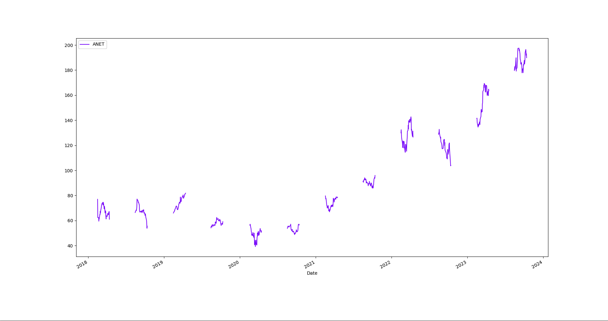
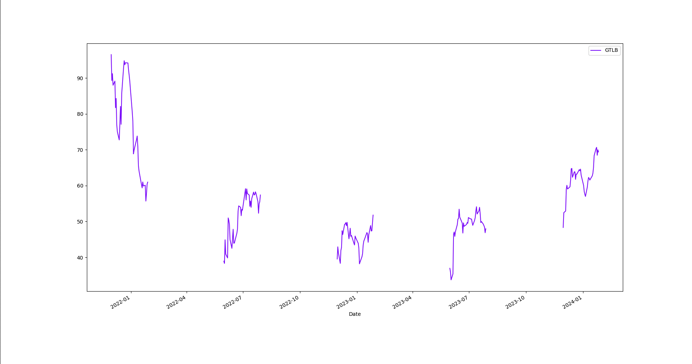

# Stock analysis around companies ESPP exercise dates

This is a personal stock analysis project on US listed stock companies focused around their ESPP exercised date.

Each company has a different exercise date, that can be fetched via their official ESPP registration statement available on the SEC website via their custom searching tool EDGAR.

The code allows the user to look at all companies stock that have their ESPP exerise date coming up within 2 weeks.

It also allows look up on a specific company via its official stock symbol/ticker.

Each segments represent the stock price starting on their respective exercise date.

